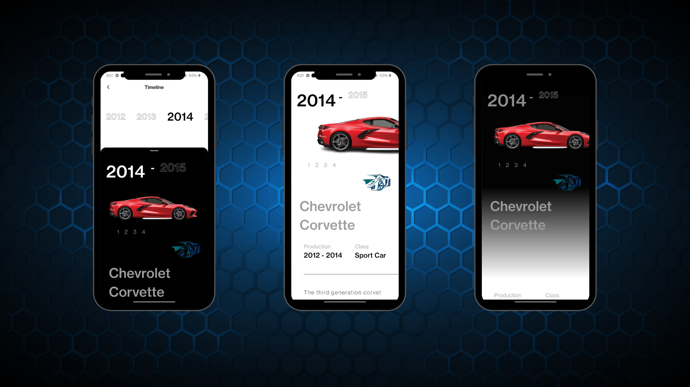

# FLutter UI Challange

## Getting Started

To get started with the Car Control Dashboard app, follow these steps:

1. **Prerequisites:** Make sure you have Flutter installed on your system. If you don't have it yet, you can install it from the official Flutter website.

2. **Clone the repository:** Clone this repository to your local machine using the following command:

3. **Install Dependencies:** Navigate to the project directory and install the required dependencies:

4. **Run the App:** Now, you can run the app on your connected device or emulator:

## Screenshots

## Contributing

We welcome contributions from the community! If you'd like to contribute to this project, follow these steps:

1. Fork this repository.

2. Create a new branch for your feature or bug fix.

3. Make your changes and commit them with descriptive commit messages.

4. Push your changes to your forked repository.

5. Create a pull request to the `main` branch of this repository.

We'll review your pull request and merge it if everything looks good!

## Acknowledgements

We would like to thank the Flutter and GetX communities for their valuable contributions and support.

## Contact

If you have any questions or suggestions regarding the project, feel free to contact us at rh676838@gmail.com.

